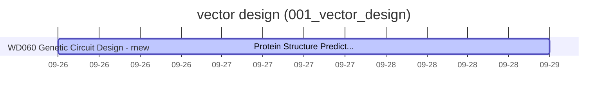
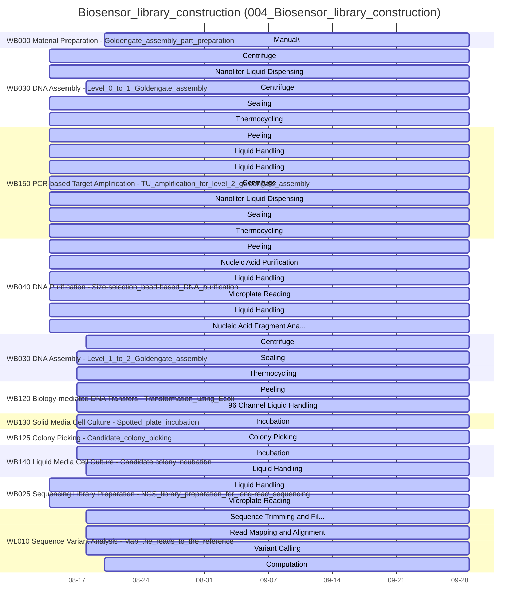

```mermaid
gantt
    title vector design (001_vector_design)
    dateFormat  YYYY-MM-DD
    axisFormat %m-%d

    section WD060 Genetic Circuit Design - rnew
    Protein Structure Predict... :active, USW070, 2025-09-26, 2025-09-29
```

## golden gate assay

(표시할 데이터가 없습니다.)

```mermaid
gantt
    title Biosensor_library_construction (004_Biosensor_library_construction)
    dateFormat  YYYY-MM-DD
    axisFormat %m-%d

    section WB000 Material Preparation - Goldengate_assembly_part_preparation
    Manual\ :active, UH400, 2025-08-20, 2025-09-29

    section WB030 DNA Assembly - Level_0_to_1_Goldengate_assembly
    Centrifuge :active, UHW255, 2025-08-14, 2025-09-29
    Nanoliter Liquid Dispensing :active, UHW030, 2025-08-14, 2025-09-29
    Centrifuge :active, UHW255, 2025-08-18, 2025-09-29
    Sealing :active, UHW130, 2025-08-14, 2025-09-29
    Thermocycling :active, UHW100, 2025-08-14, 2025-09-29

    section WB150 PCR-based Target Amplification - TU_amplification_for_level_2_goldengate_assembly
    Peeling :active, UHW140, 2025-08-14, 2025-09-29
    Liquid Handling :active, UHW010, 2025-08-14, 2025-09-29
    Liquid Handling :active, UHW010, 2025-08-14, 2025-09-29
    Centrifuge :active, UHW255, 2025-08-14, 2025-09-29
    Nanoliter Liquid Dispensing :active, UHW030, 2025-08-14, 2025-09-29
    Sealing :active, UHW130, 2025-08-14, 2025-09-29
    Thermocycling :active, UHW100, 2025-08-14, 2025-09-29

    section WB040 DNA Purification - Size-selection_bead-based_DNA_purification
    Peeling :active, UHW140, 2025-08-14, 2025-09-29
    Nucleic Acid Purification :active, UHW250, 2025-08-14, 2025-09-29
    Liquid Handling :active, UHW010, 2025-08-14, 2025-09-29
    Microplate Reading :active, UHW380, 2025-08-14, 2025-09-29
    Liquid Handling :active, UHW010, 2025-08-14, 2025-09-29
    Nucleic Acid Fragment Ana... :active, UHW230, 2025-08-14, 2025-09-29

    section WB030 DNA Assembly - Level_1_to_2_Goldengate_assembly
    Centrifuge :active, UHW255, 2025-08-18, 2025-09-29
    Sealing :active, UHW130, 2025-08-17, 2025-09-29
    Thermocycling :active, UHW100, 2025-08-17, 2025-09-29

    section WB120 Biology-mediated DNA Transfers - Transformation_using_Ecoli
    Peeling :active, UHW140, 2025-08-17, 2025-09-29
    96 Channel Liquid Handling :active, UHW020, 2025-08-17, 2025-09-29

    section WB130 Solid Media Cell Culture - Spotted_plate_incubation
    Incubation :active, UHW180, 2025-08-17, 2025-09-29

    section WB125 Colony Picking - Candidate_colony_picking
    Colony Picking :active, UHW060, 2025-08-17, 2025-09-29

    section WB140 Liquid Media Cell Culture - Candidate colony incubation
    Incubation :active, UHW180, 2025-08-17, 2025-09-29
    Liquid Handling :active, UHW010, 2025-08-18, 2025-09-29

    section WB025 Sequencing Library Preparation - NGS_library_preparation_for_long-read_sequencing
    Liquid Handling :active, UH010, 2025-08-14, 2025-09-29
    Microplate Reading :active, UH380, 2025-08-14, 2025-09-29

    section WL010 Sequence Variant Analysis - Map_the_reads_to_the_reference
    Sequence Trimming and Fil... :active, USW120, 2025-08-18, 2025-09-29
    Read Mapping and Alignment :active, USW130, 2025-08-18, 2025-09-29
    Variant Calling :active, USW170, 2025-08-18, 2025-09-29
    Computation :active, USW340, 2025-08-20, 2025-09-29
```

## Strain_engineering

(표시할 데이터가 없습니다.)