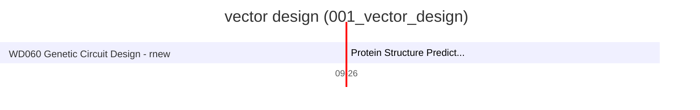
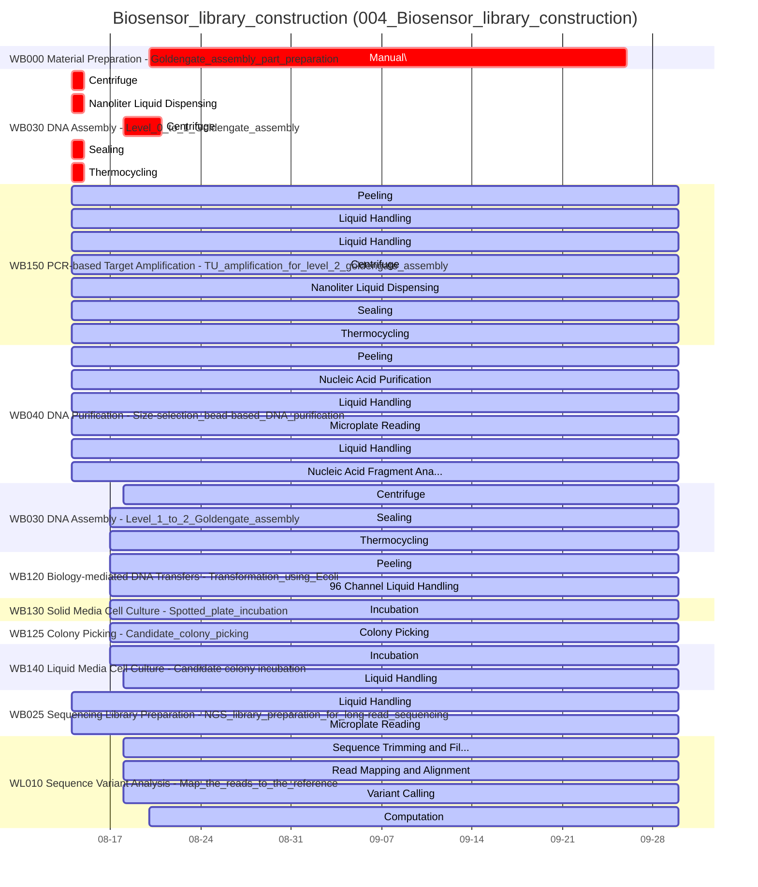

## 🔬 워크플로 템플릿 흐름도
> 가장 상세한 워크플로를 가진 'Biosensor_library_construction' 실험을 기준으로 생성되었습니다.

```mermaid
graph LR

    subgraph wf0 ["WB000 Material Preparation - Goldengate_assembly_part_preparation"]
        uo_0_0["UH400<br/>Manual\"]
    end

    subgraph wf1 ["WB030 DNA Assembly - Level_0_to_1_Goldengate_assembly"]
        uo_1_0["UHW255<br/>Centrifuge"]
        uo_1_1["UHW030<br/>Nanoliter Liquid Dispensing"]
        uo_1_2["UHW255<br/>Centrifuge"]
        uo_1_3["UHW130<br/>Sealing"]
        uo_1_4["UHW100<br/>Thermocycling"]
        uo_1_0 --> uo_1_1 --> uo_1_2 --> uo_1_3 --> uo_1_4
    end

    subgraph wf2 ["WB150 PCR-based Target Amplification - TU_amplification_for_level_2_goldengate_assembly"]
        uo_2_0["UHW140<br/>Peeling"]
        uo_2_1["UHW010<br/>Liquid Handling"]
        uo_2_2["UHW010<br/>Liquid Handling"]
        uo_2_3["UHW255<br/>Centrifuge"]
        uo_2_4["UHW030<br/>Nanoliter Liquid Dispensing"]
        uo_2_5["UHW130<br/>Sealing"]
        uo_2_6["UHW100<br/>Thermocycling"]
        uo_2_0 --> uo_2_1 --> uo_2_2 --> uo_2_3 --> uo_2_4 --> uo_2_5 --> uo_2_6
    end

    subgraph wf3 ["WB040 DNA Purification - Size-selection_bead-based_DNA_purification"]
        uo_3_0["UHW140<br/>Peeling"]
        uo_3_1["UHW250<br/>Nucleic Acid Purification"]
        uo_3_2["UHW010<br/>Liquid Handling"]
        uo_3_3["UHW380<br/>Microplate Reading"]
        uo_3_4["UHW010<br/>Liquid Handling"]
        uo_3_5["UHW230<br/>Nucleic Acid Fragment Analysis"]
        uo_3_0 --> uo_3_1 --> uo_3_2 --> uo_3_3 --> uo_3_4 --> uo_3_5
    end

    subgraph wf4 ["WB030 DNA Assembly - Level_1_to_2_Goldengate_assembly"]
        uo_4_0["UHW255<br/>Centrifuge"]
        uo_4_1["UHW130<br/>Sealing"]
        uo_4_2["UHW100<br/>Thermocycling"]
        uo_4_0 --> uo_4_1 --> uo_4_2
    end

    subgraph wf5 ["WB120 Biology-mediated DNA Transfers - Transformation_using_Ecoli"]
        uo_5_0["UHW140<br/>Peeling"]
        uo_5_1["UHW020<br/>96 Channel Liquid Handling"]
        uo_5_0 --> uo_5_1
    end

    subgraph wf6 ["WB130 Solid Media Cell Culture - Spotted_plate_incubation"]
        uo_6_0["UHW180<br/>Incubation"]
    end

    subgraph wf7 ["WB125 Colony Picking - Candidate_colony_picking"]
        uo_7_0["UHW060<br/>Colony Picking"]
    end

    subgraph wf8 ["WB140 Liquid Media Cell Culture - Candidate colony incubation"]
        uo_8_0["UHW180<br/>Incubation"]
        uo_8_1["UHW010<br/>Liquid Handling"]
        uo_8_0 --> uo_8_1
    end

    subgraph wf9 ["WB045 DNA Extraction - Plate-based_plasmid_prep"]
    end

    subgraph wf10 ["WB025 Sequencing Library Preparation - NGS_library_preparation_for_long-read_sequencing"]
        uo_10_0["UH010<br/>Liquid Handling"]
        uo_10_1["UH380<br/>Microplate Reading"]
        uo_10_0 --> uo_10_1
    end

    subgraph wf11 ["WT010 Nucleotide Sequencing - Nanopore_long-read_sequencing"]
    end

    subgraph wf12 ["WL010 Sequence Variant Analysis - Map_the_reads_to_the_reference"]
        uo_12_0["USW120<br/>Sequence Trimming and Filtering"]
        uo_12_1["USW130<br/>Read Mapping and Alignment"]
        uo_12_2["USW170<br/>Variant Calling"]
        uo_12_3["USW340<br/>Computation"]
        uo_12_0 --> uo_12_1 --> uo_12_2 --> uo_12_3
    end

    wf0 --> wf1 --> wf2 --> wf3 --> wf4 --> wf5 --> wf6 --> wf7 --> wf8 --> wf9 --> wf10 --> wf11 --> wf12
```

 

# 📊 실험별 진행 현황 (간트 차트)

```mermaid
gantt
    title vector design (001_vector_design)
    dateFormat  YYYY-MM-DD
    axisFormat %m-%d

    section WD060 Genetic Circuit Design - rnew
    Protein Structure Predict... :crit, USW070, 2025-09-26, 2025-09-26
```

## golden gate assay

(표시할 데이터가 없습니다.)

```mermaid
gantt
    title Biosensor_library_construction (004_Biosensor_library_construction)
    dateFormat  YYYY-MM-DD
    axisFormat %m-%d

    section WB000 Material Preparation - Goldengate_assembly_part_preparation
    Manual\ :crit, UH400, 2025-08-20, 2025-09-26

    section WB030 DNA Assembly - Level_0_to_1_Goldengate_assembly
    Centrifuge :crit, UHW255, 2025-08-14, 2025-08-15
    Nanoliter Liquid Dispensing :crit, UHW030, 2025-08-14, 2025-08-15
    Centrifuge :crit, UHW255, 2025-08-18, 2025-08-21
    Sealing :crit, UHW130, 2025-08-14, 2025-08-15
    Thermocycling :crit, UHW100, 2025-08-14, 2025-08-15

    section WB150 PCR-based Target Amplification - TU_amplification_for_level_2_goldengate_assembly
    Peeling :active, UHW140, 2025-08-14, 2025-09-30
    Liquid Handling :active, UHW010, 2025-08-14, 2025-09-30
    Liquid Handling :active, UHW010, 2025-08-14, 2025-09-30
    Centrifuge :active, UHW255, 2025-08-14, 2025-09-30
    Nanoliter Liquid Dispensing :active, UHW030, 2025-08-14, 2025-09-30
    Sealing :active, UHW130, 2025-08-14, 2025-09-30
    Thermocycling :active, UHW100, 2025-08-14, 2025-09-30

    section WB040 DNA Purification - Size-selection_bead-based_DNA_purification
    Peeling :active, UHW140, 2025-08-14, 2025-09-30
    Nucleic Acid Purification :active, UHW250, 2025-08-14, 2025-09-30
    Liquid Handling :active, UHW010, 2025-08-14, 2025-09-30
    Microplate Reading :active, UHW380, 2025-08-14, 2025-09-30
    Liquid Handling :active, UHW010, 2025-08-14, 2025-09-30
    Nucleic Acid Fragment Ana... :active, UHW230, 2025-08-14, 2025-09-30

    section WB030 DNA Assembly - Level_1_to_2_Goldengate_assembly
    Centrifuge :active, UHW255, 2025-08-18, 2025-09-30
    Sealing :active, UHW130, 2025-08-17, 2025-09-30
    Thermocycling :active, UHW100, 2025-08-17, 2025-09-30

    section WB120 Biology-mediated DNA Transfers - Transformation_using_Ecoli
    Peeling :active, UHW140, 2025-08-17, 2025-09-30
    96 Channel Liquid Handling :active, UHW020, 2025-08-17, 2025-09-30

    section WB130 Solid Media Cell Culture - Spotted_plate_incubation
    Incubation :active, UHW180, 2025-08-17, 2025-09-30

    section WB125 Colony Picking - Candidate_colony_picking
    Colony Picking :active, UHW060, 2025-08-17, 2025-09-30

    section WB140 Liquid Media Cell Culture - Candidate colony incubation
    Incubation :active, UHW180, 2025-08-17, 2025-09-30
    Liquid Handling :active, UHW010, 2025-08-18, 2025-09-30

    section WB025 Sequencing Library Preparation - NGS_library_preparation_for_long-read_sequencing
    Liquid Handling :active, UH010, 2025-08-14, 2025-09-30
    Microplate Reading :active, UH380, 2025-08-14, 2025-09-30

    section WL010 Sequence Variant Analysis - Map_the_reads_to_the_reference
    Sequence Trimming and Fil... :active, USW120, 2025-08-18, 2025-09-30
    Read Mapping and Alignment :active, USW130, 2025-08-18, 2025-09-30
    Variant Calling :active, USW170, 2025-08-18, 2025-09-30
    Computation :active, USW340, 2025-08-20, 2025-09-30
```

## Strain_engineering

(표시할 데이터가 없습니다.)